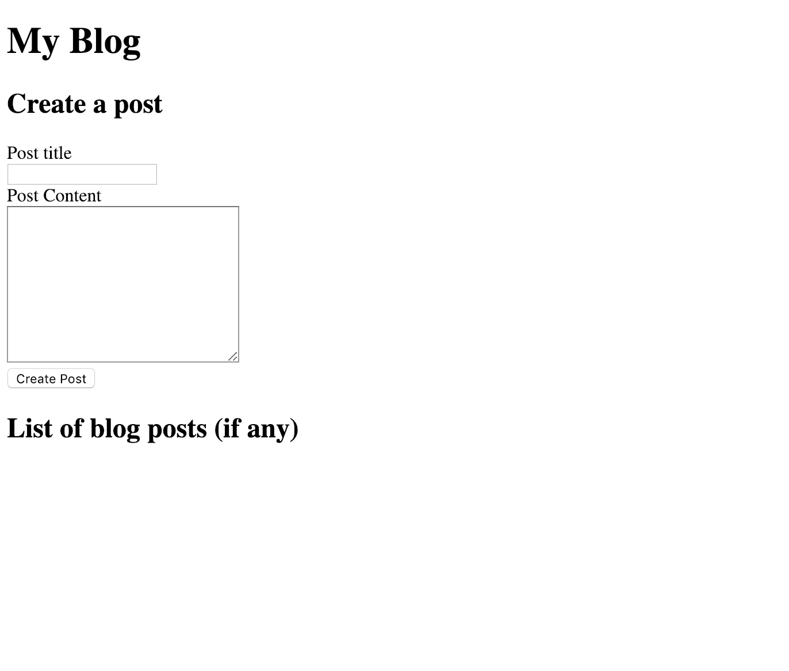

# Lunch and Learn: Session Two

## !!Before session requirements!!

In order to communicate with our API, we need to have a web server running. Fortunately, [Express.js](https://expressjs.com) makes this fast and simple so I have already done it for you. If you want to follow along with typing code at the session, you need to ensure you can run the web server!

Things you need installed first:
1. [Git](https://git-scm.com/book/en/v2/Getting-Started-Installing-Git)
2. [Node.js](https://nodejs.org/en/download)

You can verify these are installed by opening your terminal and typing `git -v` for Git, and `node -v` for Node.js. This will tell you the softwares version.

**Installing Git:**   
https://www.atlassian.com/git/tutorials/install-git

**Installing Node.js:**  
Node.js is typically just an installer that has an installation wizard - https://nodejs.org/en/download/

**If you have any questions or concerns about this, please contact me before the session.**. I can't promise to have time to help during the session.

### Downloading, installing and running the application.
1. Clone this repository and CD to it:
    > `git clone https://github.com/QueryClick/lunch-and-learn.git && cd lunch-and-learn`
2. CD (change directory) to the session two directory
    > `cd session-two`
3. Install packages needed:
    > `npm i`
4. Once installed, start the application:
    > `npm start`
5. Navigate to [http://localhost:8080](http://localhost:8080) or click the link in your terminal. If you changed the port, please replace port `8080` with the new port at the end of the URL.

**You should this in your browser:**

If you cannot get Git installed or working, you can [download the zip here](https://github.com/QueryClick/lunch-and-learn/archive/master.zip).